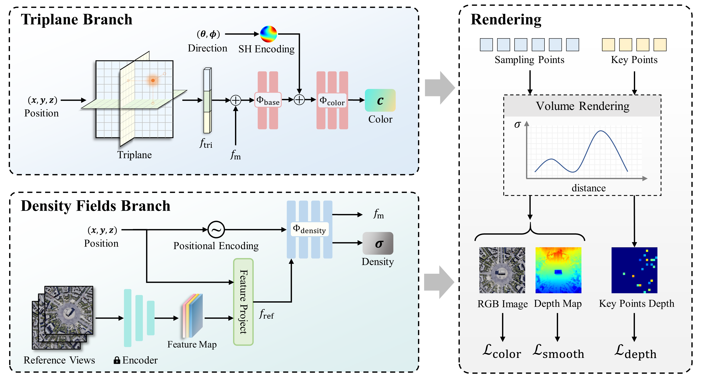

<div align="center">
    <h2>
        TriDF: Triplane-Accelerated Density Fields for Few-Shot Remote Sensing Novel View Synthesis
    </h2>
</div>
<br>

<div align="center">

  

</div>
<br>
<div align="center">
  <a href="https://kanehub.github.io/TriDF/">
    <span style="font-size: 20px; ">Project Page</span>
  </a>
  &nbsp;&nbsp;&nbsp;&nbsp;
  <a href="https://arxiv.org/abs/2410.xxxxx">
    <span style="font-size: 20px; ">arXiv</span>
  </a>
</div>
<br>
<br>

[](https://github.com/kanehub/TriDF)
[](LICENSE)
[](https://arxiv.org/abs/2503.13347)

<br>
<br>

<div align="center">

</div>


## Introduction

This is the official implementation of the paper "TriDF: Triplane-Accelerated Density Fields for Few-Shot Remote Sensing Novel View Synthesis".

If you find this project helpful, please give us a star ⭐️, your support is our greatest motivation.

Comparison of **Rendering Quality** and **Reconstruction Time** on the LEVIR-NVS Dataset


Visulization of some scenes in LEVIR-NVS dataset


## Installation

Please install the following dependency first:

- Pytorch

    Tested with pytorch 1.13.0 + cuda 11.7

```bash
pip install torch==1.13.0+cu117 torchvision==0.14.0+cu117 torchaudio==0.13.0 --extra-index-url https://download.pytorch.org/whl/cu117
```
- NerfAcc
nerfacc <= 0.3.5

    Download whl from [here](https://nerfacc-bucket.s3.us-west-2.amazonaws.com/whl/index.html) and install it locally


- [nvdiffrast](https://nvlabs.github.io/nvdiffrast/)  
- [tiny-cuda-nn](https://github.com/NVlabs/tiny-cuda-nn)  

And then install the following dependencies using pip
```bash
pip install -r requirements.txt
```

## Data
### LEVIR-NVS

Please download the [LEVIR-NVS](https://drive.google.com/drive/folders/1orEpAN-SLF0i7yFn_mrPVmtM12E2pcdj?usp=sharing) dataset, which contains 16 scenes. The whole dataset is organized as follows:
```
LEVIR_NVS
├──view_split.txt 
├──scene_000
├──scene_001
      ├── Images                 
      │   ├── 000.png       
      │   ├── 001.png       
      │   └── ...                
      ├── Cams                   
      │   ├── 000.txt   
      │   ├── 001.txt   
      │   └── ...                
      └── Depths  
      │   ├── 000.tiff   
      │   ├── 001.tiff   
      │   └── ...     
      └── Track  
          ├── 000.txt   
          ├── 001.txt   
          └── ...    
```
   * Camera file in ``Cams`` directory stores the camera parameters, which includes intrinsic, extrinsic and depth range:
```
extrinsic
E00 E01 E02 E03
E10 E11 E12 E13
E20 E21 E22 E23
E30 E31 E32 E33

intrinsic
K00 K01 K02
K10 K11 K12
K20 K21 K22

DEPTH_MIN DEPTH_MAX 
```

### LEVIR-SPC
Download the point cloud data [LEVIR-SPC](https://drive.google.com/file/d/19SzUPN4wMVr1y2a_EThqy58lWqhR-Xgm/view?usp=sharing) or prepare dataset yourself using COLMAP.
```shell
bash scripts/prepare_data.sh
```
The dataset is organized as follows:
```
LEVIR_SPC
├──scene_000
├──scene_001
      ├── images.txt                       
      ├── dense.ply                                 
      └── points3D.txt  
 
```

Place two datasets in the same directory as follows:
```
data
├──LEVIR_NVS
├──LEVIR_SPC
```

## Train
Taking scene_000 as an example.
```shell
python train.py --ginc configs/scene.gin --ginc configs/scene/000.gin
```

## Evaluate

Download the pretrained weights from [Google Drive](https://drive.google.com/file/d/1ucwy7HaXyjDk_GCAsE-veFXu-b_SaDm2/view?usp=sharing), and unzip into the repo directory. The checkpoints directory should be organized as follows:

```
checkpoint
├──scene_000
├──scene_001
      ├── model_030000.pth
```

```shell
python evaluation/eval_models.py --ginc configs/scene.gin --ginc configs/scene/000.gin --ginb Config.ckpt_path={checkpoint_path}
```
## Render the results
```shell
python evaluation/render_path.py --ginc configs/scene/000.gin
```

## Citation
If you find this work useful, please consider citing:
```
@article{kang2025tridf,
  title={TriDF: Triplane-Accelerated Density Fields for Few-Shot Remote Sensing Novel View Synthesis},
  author={Kang, Jiaming and Chen, Keyan and Zou, Zhengxia and Shi, Zhenwei},
  journal={arXiv preprint arXiv:2503.13347},
  year={2025}
}
```
